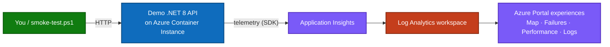

# Azure Monitor & Application Insights Demo

A presentation-ready demo of **Azure Monitor** and **Application Insights**
observability. A small **.NET 8 web API** is deployed to Azure and instrumented with
Application Insights, then exercised to produce the full range of telemetry — successful
requests, failures, slow operations, dependencies, and custom events — so every
Application Insights experience lights up with real data.

> **📘 Full deployment guidance:** **[docs/deployment-guidance.md](docs/deployment-guidance.md)**
> — overview, how to enable App Insights, the demo scenario, prerequisites, PowerShell
> deployment, components, and colored architecture diagrams.

## Demo scenario



The app deliberately exposes endpoints that each map to an Application Insights experience:

| Endpoint | What it generates | Where to see it |
|----------|-------------------|-----------------|
| `/api/health` | Healthy request | **Performance**, **Live Metrics** |
| `/api/products` | Request + in-memory dependency | **Application Map** |
| `/api/simulate-error` | ~30% throw an exception (HTTP 500) | **Failures** |
| `/api/load-test` | CPU-bound work | **Performance** |
| `/api/memory-test` | Memory alloc + custom metric/event | **Metrics**, **Logs** |

> **Advanced:** an optional **5-service mesh**
> ([`scripts/deploy-mesh-aci.ps1`](scripts/deploy-mesh-aci.ps1)) deploys five
> interconnected containers that call each other, so the **Application Map** renders a
> real multi-node distributed topology.

## Attribution

This demo **adopts** the upstream project
[`mhuescar/azure-monitor-demo`](https://github.com/mhuescar/azure-monitor-demo),
licensed under the **MIT License**, vendored in
[`azure-monitor-demo/`](azure-monitor-demo/). This repository adds the ACI deployment
path, PowerShell scripts, the deployment guidance, and the 5-service mesh demo.

## Quick start (PowerShell)

```powershell
az login
az account set --subscription "<subscription-id>"

# Creates RG, Log Analytics, App Insights, ACR, builds the image, runs ACI.
powershell.exe -NoProfile -ExecutionPolicy Bypass -File "scripts\deploy-aci.ps1"

# Generate traffic, then verify telemetry ingestion.
powershell.exe -NoProfile -ExecutionPolicy Bypass -File "scripts\smoke-test.ps1"
powershell.exe -NoProfile -ExecutionPolicy Bypass -File "scripts\check-telemetry.ps1"
```

Full steps and the Infrastructure-as-Code (ARM) path:
[docs/deployment-guidance.md](docs/deployment-guidance.md).

## What gets deployed

Five Azure resources in one resource group (`demo-monitor-rg`):

| Resource | Type | Purpose |
|----------|------|---------|
| `log-<token>` | Log Analytics workspace | Stores all telemetry |
| `appi-<token>` | Application Insights (workspace-based) | APM / query surface |
| `acr<token>` | Container Registry (Basic) | Holds the `webdemo:latest` image |
| `appi-demo-web` | Container Instance | **Runs the app** (port 8080) |
| Failure Anomalies | Smart-detector alert rule | Auto-created with App Insights |

> **Why ACI (not App Service):** this subscription has App Service dedicated-worker VM
> quota = 0, so the demo runs on Azure Container Instances using the same container
> image and the same App Insights SDK. See
> [docs/aci-deployment-guide.md](docs/aci-deployment-guide.md) for the deep-dive.

## What's here

| Path | Purpose |
|------|---------|
| [`docs/deployment-guidance.md`](docs/deployment-guidance.md) | **Primary** deployment guidance (overview → deploy → diagrams) |
| [`docs/aci-deployment-guide.md`](docs/aci-deployment-guide.md) | Deep-dive: portal blades + the 5-ACI mesh |
| [`docs/demo-walkthrough.md`](docs/demo-walkthrough.md) | Suggested ~15-min presentation flow |
| [`docs/cost.md`](docs/cost.md) | Approximate cost & cost-control guidance |
| [`scripts/`](scripts/) | PowerShell deploy / traffic / verify scripts |
| [`azure-monitor-demo/`](azure-monitor-demo/) | App source, Dockerfile, ARM template |
| [`specs/001-appinsights-demo/`](specs/001-appinsights-demo/) | Spec, plan, tasks, research |

## Security note

No secrets are committed. The root [`.gitignore`](.gitignore) excludes `.env` files,
`.secrets/`, and local parameter files. The container receives the App Insights
connection string at runtime as a **secure environment variable**.

## Honesty & scope

Per the project constitution, this repo states only what was verified:

- All telemetry shown in the demo is generated by exercising the real app — nothing is
  fabricated.
- The actual app routes are `/api/health`, `/api/products`, `/api/simulate-error`,
  `/api/load-test`, `/api/memory-test` (confirmed in the code).
- Cost figures in [docs/cost.md](docs/cost.md) are **approximate**, not billing
  guarantees.

## License

The vendored `azure-monitor-demo/` retains its upstream **MIT** license. See
[`azure-monitor-demo/LICENSE`](azure-monitor-demo/LICENSE).
