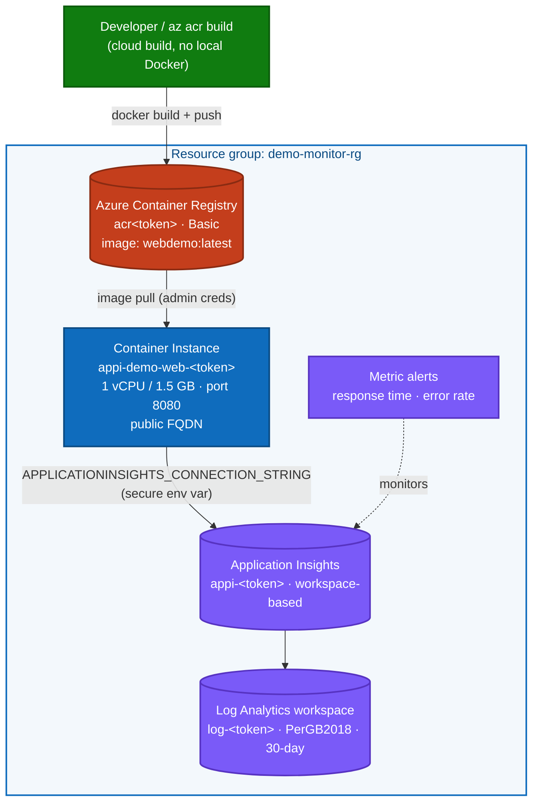
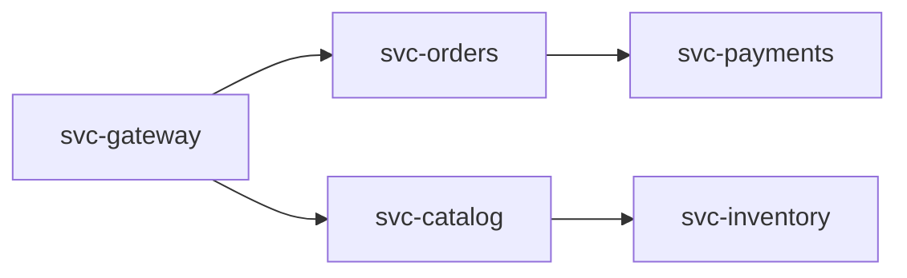

# Deploy the Application Insights demo on Azure Container Instances (ACI)

> **Audience:** anyone who wants to stand up this demo from scratch and explore what
> Application Insights shows you. No prior Azure Monitor experience required.
>
> **Why ACI (not App Service):** this subscription has **App Service dedicated-worker VM
> quota = 0**, so a Basic/Standard App Service plan cannot be created. Azure Container
> Instances use a separate quota and run the exact same container image. The app uses the
> Application Insights **SDK** (`AddApplicationInsightsTelemetry()` reading
> `APPLICATIONINSIGHTS_CONNECTION_STRING`), so it emits the same telemetry on any host.

---

## 1. What is Application Insights? (the 60-second overview)

Application Insights is the **Application Performance Monitoring (APM)** feature of Azure
Monitor. Your app is instrumented with an SDK (or the OpenTelemetry distro); that SDK
ships **telemetry** (requests, dependencies, exceptions, traces, custom events/metrics)
to an ingestion endpoint, where it is stored in a **Log Analytics workspace** and made
explorable through the portal experiences (Application Map, Failures, Performance, Logs…).

**What Application Insights looks like (official Microsoft Learn overview):**


*Source: [Microsoft Learn — Application Insights overview](https://learn.microsoft.com/en-us/azure/azure-monitor/app/app-insights-overview).*

**Where Application Insights sits within Azure Monitor:**


*Source: [Microsoft Learn — Azure Monitor overview](https://learn.microsoft.com/en-us/azure/azure-monitor/fundamentals/overview).*

**How telemetry flows — app → SDK → ingestion → Log Analytics → portal:**


*Source: [Microsoft Learn — Investigate missing telemetry](https://learn.microsoft.com/en-us/troubleshoot/azure/azure-monitor/app-insights/telemetry/investigate-missing-telemetry).*

**What kinds of telemetry are collected (the data model):**


*Source: [Microsoft Learn — Application Insights telemetry data model](https://learn.microsoft.com/en-us/azure/azure-monitor/app/data-model-complete).*

| Telemetry type | What it captures | Log Analytics table |
|----------------|------------------|---------------------|
| Request | Each incoming HTTP call, duration, result code | `AppRequests` |
| Dependency | Outbound calls (SQL, HTTP, queues) | `AppDependencies` |
| Exception | Unhandled/handled exceptions with stack traces | `AppExceptions` |
| Trace | Log lines (`ILogger`) with severity | `AppTraces` |
| Custom event / metric | Business events and KPIs you emit | `AppEvents` / `AppMetrics` |

---

## 2. What gets deployed



| Resource | Type | Purpose |
|----------|------|---------|
| `log-<token>` | Log Analytics workspace | Backing store for all telemetry |
| `appi-<token>` | Application Insights (workspace-based) | APM resource / query surface |
| `acr<token>` | Container Registry (Basic) | Holds the `webdemo:latest` image |
| `appi-demo-web-<token>` | Container Instance | Runs the web app, public on port 8080 |
| High Response Time / High Error Rate | Metric alerts | Fire on slow or failing requests |

---

## 2a. Is it only ACI? — what's actually deployed

**No — ACI is only the *compute host*.** The demo deploys **five** Azure resources. Verified
live against the resource group (`az resource list -g demo-monitor-rg`):

| # | Resource type | Role | Is it ACI? |
|---|---------------|------|-----------|
| 1 | `Microsoft.OperationalInsights/workspaces` | Log Analytics workspace — stores all telemetry | No |
| 2 | `Microsoft.Insights/components` | Application Insights — the APM/query surface | No |
| 3 | `Microsoft.ContainerRegistry/registries` | Container Registry — holds the image | No |
| 4 | `Microsoft.ContainerInstance/containerGroups` | **Container Instance — runs the app** | **Yes** |
| 5 | `microsoft.alertsmanagement/smartDetectorAlertRules` | "Failure Anomalies" smart-detector rule (auto-created with App Insights) | No |

So the app **runs on ACI**, but it is **monitored by** Application Insights + Log Analytics,
**built from** an Azure Container Registry, and **watched by** a smart-detector alert rule.

### About the "InMemory (OTHER)" node in the Application Map

In the Application Map you'll see `appi-demo-web` calling a node labelled **InMemory
(OTHER)**. That is **not a separate deployed Azure service** — it is the app's own
**in-memory data store**, which the App Insights SDK auto-tracks as a *dependency* and
groups under the generic type `OTHER`. There is no database resource behind it; the demo
intentionally uses in-memory data so no SQL/Storage is required. The `24 calls / 279.8 ms`
on that edge are the app's internal data lookups, captured as dependency telemetry.

---

## 3. Prerequisites

| Tool | Check | Install |
|------|-------|---------|
| Azure CLI | `az version` | <https://aka.ms/installazurecli> |
| App Insights CLI ext | `az extension show -n application-insights` | `az extension add -n application-insights` |
| PowerShell 5.1+ | `$PSVersionTable.PSVersion` | built-in on Windows |

> No local Docker is required — the image is built **in the cloud** with `az acr build`.

---

## 4. Deploy — Option A: one scripted path (recommended)

From the repository root:

```powershell
# Full path: creates RG, Log Analytics, App Insights, ACR, builds the image, runs ACI.
powershell.exe -NoProfile -ExecutionPolicy Bypass -File "scripts\deploy-aci.ps1"
```

The script prints `DEPLOY_RESULT=SUCCESS` and an `APP_URL=...` line when finished.
To reuse already-created resources (faster re-deploys), use
[`scripts/finish-aci.ps1`](../scripts/finish-aci.ps1).

---

## 5. Deploy — Option B: Infrastructure as Code (ARM template)

The ARM template lives at [`azure-monitor-demo/infra/main.json`](../azure-monitor-demo/infra/main.json).
Because **ACI cannot pull an image that does not exist yet**, deploy in three phases.

### 5.1 Sign in & create the resource group

```powershell
az login
az account set --subscription "<subscription-id-or-name>"
az group create --name demo-monitor-rg --location "North Europe"
```

### 5.2 Phase 1 — registry + monitoring only (`deployContainerGroup=false`)

```powershell
az deployment group create `
  --resource-group demo-monitor-rg `
  --template-file azure-monitor-demo/infra/main.json `
  --parameters azure-monitor-demo/infra/main.parameters.json `
  --parameters deployContainerGroup=false
```

Capture the registry name from the outputs:

```powershell
$acr = az deployment group show -g demo-monitor-rg -n main `
  --query "properties.outputs.containerRegistryName.value" -o tsv
Write-Host "ACR = $acr"
```

### 5.3 Phase 2 — build & push the image (cloud build)

```powershell
az acr build --registry $acr --image webdemo:latest azure-monitor-demo/src/web
```

### 5.4 Phase 3 — create the container (`deployContainerGroup=true`)

```powershell
az deployment group create `
  --resource-group demo-monitor-rg `
  --template-file azure-monitor-demo/infra/main.json `
  --parameters azure-monitor-demo/infra/main.parameters.json `
  --parameters deployContainerGroup=true

# Live URL:
az deployment group show -g demo-monitor-rg -n main `
  --query "properties.outputs.appUrl.value" -o tsv
```

> **Parameters** (see [`main.parameters.json`](../azure-monitor-demo/infra/main.parameters.json)):
> `environmentName`, `location`, `containerImageRepository` (default `webdemo:latest`),
> `containerCpu` (1), `containerMemoryInGb` ("1.5"), `deployContainerGroup` (bool gate).

---

## 6. Generate traffic & verify telemetry

```powershell
# Hit the endpoints (health, products, an intentional 30% error, load + memory tests)
powershell.exe -NoProfile -ExecutionPolicy Bypass -File "scripts\smoke-test.ps1"

# Confirm rows landed in App Insights (queries the Log Analytics tables directly)
powershell.exe -NoProfile -ExecutionPolicy Bypass -File "scripts\check-telemetry.ps1"
```

Endpoints exposed by the app:
`/api/health` · `/api/products` (GET/POST) · `/api/simulate-error` · `/api/load-test` · `/api/memory-test`

> **Ingestion latency:** first telemetry can take **2–5 minutes** to appear. If a query is
> empty, wait and re-run `check-telemetry.ps1`.
>
> **Gotcha:** for a *workspace-based* component, the classic
> `az monitor app-insights query` (`requests`/`exceptions` schema) can return empty even
> when data is present. Query the workspace tables (`AppRequests`, `AppExceptions`, …)
> instead — that is what `check-telemetry.ps1` does.

---

## 7. Explore in the Azure Portal — every blade explained

Open **portal.azure.com** → search `appi-` → open your Application Insights resource. The
left navigation matches the blades below. Each is what you click to answer a specific
question about your app.

### Top-level / resource management

| Blade | What it does | When you use it |
|-------|--------------|-----------------|
| **Overview** | Landing dashboard: failed requests, server response time, server requests, availability tiles | Quick health glance every morning |
| **Activity log** | Control-plane audit trail (who created/changed this resource) | "Who changed the alert rule?" |
| **Access control (IAM)** | Assign Azure RBAC roles (e.g. *Monitoring Reader/Contributor*) | Grant a teammate read-only access |
| **Tags** | Key/value metadata on the resource | Cost allocation, ownership |
| **Diagnose and solve problems** | Guided troubleshooters for common AI issues (no data, sampling, etc.) | "Why is telemetry missing?" |
| **Resource visualizer** | Map of this component and its connected resources | See how AI links to the workspace |

### Investigate — the core APM experiences

| Blade | What it does | When you use it |
|-------|--------------|-----------------|
| **Application map** | Topology of your app and its dependencies with health/latency on each node and edge | Find which dependency is slow or failing |
| **Smart detection** | ML-driven automatic anomaly alerts (failure-rate spikes, latency degradations) | Get told about problems you didn't write a rule for |
| **Live metrics** | Real-time (1-second) stream of requests, failures, CPU/memory — no ingestion delay | Watch a deployment or load test live |
| **Search** | Free-text/structured search across individual telemetry items end-to-end transaction view | Trace one failed request through the stack |
| **Availability** | Synthetic uptime tests (URL ping / standard) from multiple regions | Know the app is up before users do |
| **Failures** | Aggregated failed requests, exceptions, and failed dependencies by operation | Triage the top exceptions (e.g. our `/api/simulate-error` 500s) |
| **Performance** | Response-time distribution per operation, with drill-in to slow samples | Find the slowest endpoint (`/api/load-test`) |
| **Agents (preview)** | AI-assisted investigation agents over your telemetry | Ask natural-language questions about incidents |

### Monitoring — alerting & export

| Blade | What it does | When you use it |
|-------|--------------|-----------------|
| **Alerts** | Metric/log alert rules + fired-alert history (this template ships *High Response Time* & *High Error Rate*) | Get paged when response time > 5 s or errors spike |
| **Metrics** | Metrics Explorer: chart any metric (requests/duration, requests/failed, custom) | Build a custom latency or throughput chart |
| **Diagnostic settings** | Route resource logs/metrics to a workspace, storage, or Event Hub | Long-term retention or SIEM export |

> **Tip:** start at **Failures** and **Performance** after running `smoke-test.ps1` — set the
> time range to **Last 30 minutes**. The intentional 500s from `/api/simulate-error` show
> up under Failures, and `/api/load-test` stands out under Performance.

### Run your own query (Logs / KQL)

Under **Monitoring → Logs**, paste:

```kusto
union AppRequests, AppExceptions, AppTraces, AppDependencies
| where TimeGenerated > ago(1h)
| summarize count() by Type
| order by count_ desc
```

---

## 7a. Multi-service Application Map (5 ACIs that call each other)

The single-app deploy gives you one node plus an `InMemory` dependency. To make the
**Application Map** light up as a real distributed system — like the topology in the
Application Insights overview — deploy **five** container instances that call each other
over HTTP. Two ingredients make this work:

1. **Distinct cloud role name per service** — each ACI sets `SERVICE_ROLE_NAME`, and a
   telemetry initializer stamps it as `cloud_RoleName`. Each distinct role becomes its
   own **node** on the map.
2. **Service-to-service HTTP calls** — every service reads `DOWNSTREAM_SERVICES` and calls
   the next service's `/api/call`. The App Insights SDK auto-tracks each outbound call as a
   *dependency* and propagates **W3C trace context**, so the downstream request correlates
   into the same operation. Those correlated dependencies become the **edges** on the map.

### Topology



### Deploy & drive

```powershell
# 1. Build the image once and create all 5 wired-up ACIs
powershell.exe -NoProfile -ExecutionPolicy Bypass -File "scripts\deploy-mesh-aci.ps1"

# 2. Drive traffic through the gateway (cascades through the whole chain)
powershell.exe -NoProfile -ExecutionPolicy Bypass -File "scripts\mesh-traffic.ps1" `
  -GatewayUrl "http://<gateway-fqdn>:8080" -Count 50

# 3. Confirm the map nodes + edges from telemetry
powershell.exe -NoProfile -ExecutionPolicy Bypass -File "scripts\verify-mesh.ps1"
```

### Verified result

`verify-mesh.ps1` confirms five distinct roles (50 requests each) and the exact edges:

| Caller role | Type | Target | Calls |
|-------------|------|--------|------:|
| `svc-gateway` | HTTP | `svc-orders` | 50 |
| `svc-gateway` | HTTP | `svc-catalog` | 50 |
| `svc-orders` | HTTP | `svc-payments` | 50 |
| `svc-catalog` | HTTP | `svc-inventory` | 50 |
| *(each service)* | Other | `InMemory` | 50 |

In the portal, open **Investigate → Application map** and set the range to **Last 30 minutes**.
You'll see the gateway fanning out to two branches, each with its own downstream — five
connected nodes with live latency and call counts on every edge.

> **Cost note:** this runs 5 × (1 vCPU / 1.5 GB) container instances. Delete them when done
> with the clean-up command below (they live in the same `demo-monitor-rg`).

---

## 8. Clean up

```powershell
az group delete --name demo-monitor-rg --yes --no-wait
```

---

## 9. Reference files

| File | Purpose |
|------|---------|
| [`azure-monitor-demo/infra/main.json`](../azure-monitor-demo/infra/main.json) | ACI + ACR + monitoring ARM template |
| [`azure-monitor-demo/infra/main.parameters.json`](../azure-monitor-demo/infra/main.parameters.json) | Default parameter values |
| [`azure-monitor-demo/src/web/Dockerfile`](../azure-monitor-demo/src/web/Dockerfile) | Multi-stage build for the web app |
| [`scripts/deploy-aci.ps1`](../scripts/deploy-aci.ps1) | Full scripted deploy |
| [`scripts/finish-aci.ps1`](../scripts/finish-aci.ps1) | Re-deploy reusing existing resources |
| [`scripts/smoke-test.ps1`](../scripts/smoke-test.ps1) | Generate demo traffic |
| [`scripts/check-telemetry.ps1`](../scripts/check-telemetry.ps1) | Verify ingestion via Log Analytics tables |
| [`scripts/deploy-mesh-aci.ps1`](../scripts/deploy-mesh-aci.ps1) | Deploy 5 interconnected ACIs for the multi-node Application Map |
| [`scripts/mesh-traffic.ps1`](../scripts/mesh-traffic.ps1) | Drive traffic through the mesh gateway |
| [`scripts/verify-mesh.ps1`](../scripts/verify-mesh.ps1) | Confirm distinct roles + inter-service edges |
