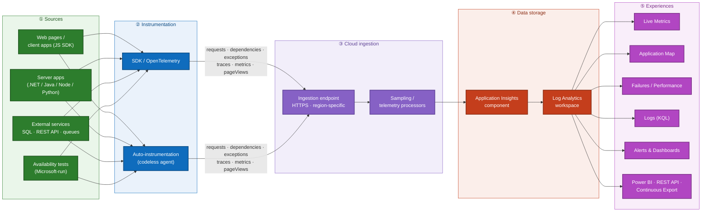
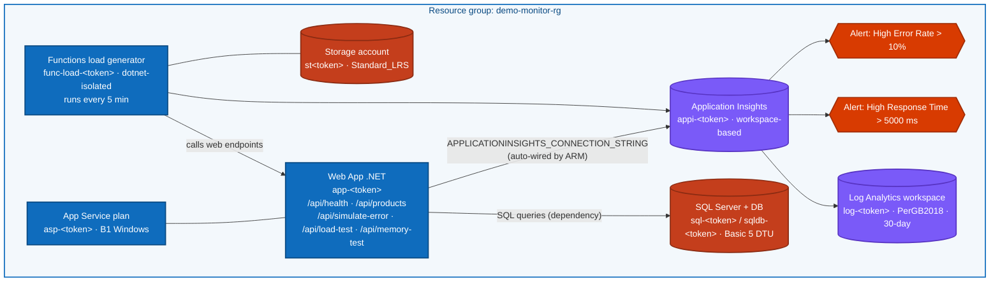
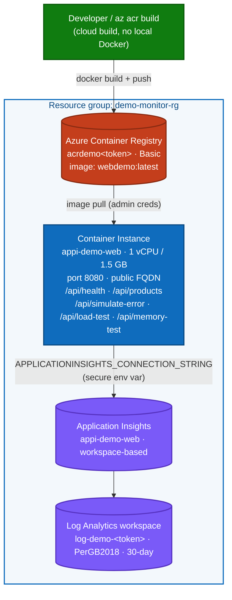

# Deployment Guidance + Application Insights Architecture

This document delivers, for the Azure Monitor & Application Insights demo:

1. **The architecture** — what Application Insights is and how telemetry flows
   (with reference diagrams found via web search and Microsoft Learn).
2. **Detailed deployment guidance** — exact, copy-paste steps with explanations.
3. A pointer to the **live deployment result** (see
   [deployment-run-log.md](deployment-run-log.md)).

> Sources: architecture references located via web search (WebIQ) and validated
> against official **Microsoft Learn** documentation (cited inline). Demo-specific
> resource facts come from the vendored `azure-monitor-demo/infra/main.json`.

---

## 1. What is Application Insights? (definition)

**Application Insights** is a feature of **Azure Monitor** that provides Application
Performance Monitoring (APM). You instrument an app; the SDK/agent collects telemetry
(requests, dependencies, exceptions, traces, metrics) and ships it over HTTPS to a
cloud ingestion endpoint, where it is stored in a **Log Analytics workspace**
(workspace-based App Insights) and surfaced through portal experiences (Live Metrics,
Application Map, Failures, Performance, Logs/KQL, Alerts).

Source: [Application Insights overview — Microsoft Learn](https://learn.microsoft.com/azure/azure-monitor/app/app-insights-overview)
and [Application Insights FAQ — data collection & storage](https://learn.microsoft.com/azure/azure-monitor/app/application-insights-faq#how-does-application-insights-handle-data-collection,-retention,-storage,-and-privacy):
*"Application Insights collects telemetry from your app and stores it in a Log
Analytics workspace. It works for apps hosted anywhere, not only in Azure."*

### Reference architecture pictures (found via web search)

The canonical four-stage picture (Instrumentation → Cloud Endpoints → Data Storage →
Experiences):

- Microsoft Learn telemetry **data model** diagram:
  <https://learn.microsoft.com/azure/azure-monitor/app/media/data-model-complete/application-insights-data-model.png>
  (from [Application Insights telemetry data model](https://learn.microsoft.com/azure/azure-monitor/app/data-model-complete))
- App Service **auto-instrumentation** toggle:
  <https://learn.microsoft.com/azure/azure-monitor/app/media/codeless-app-service/enable.png>
  (from [Autoinstrumentation for Application Insights](https://learn.microsoft.com/azure/azure-monitor/app/codeless-overview))
- Community process diagram (Instrumentation/Endpoints/Storage/Experiences):
  <https://arnav.au/wp-content/uploads/2024/01/2024-01-24-10_32_09-Application-Insights-overview-Azure-Monitor-_-Microsoft-Learn-and-7-more-pages-1024x420.png>

> Honesty note: the third link is a community blog screenshot of the official overview;
> prefer the two Microsoft Learn images as the authoritative source.

### Best-practice Application Insights architecture (four stages)

This is the canonical Azure Monitor / Application Insights model
(**Instrumentation → Cloud Endpoints → Data Storage → Experiences**), the same
four-stage architecture shown in the Microsoft Learn overview and the reference image
found via web search.



Confirmed against Microsoft Learn: telemetry is categorized into types
(`requests`, `dependencies`, `exceptions`, `traces`, `customEvents`, `customMetrics`,
`availabilityResults`, `pageViews`, `performanceCounters`). Logs are stored in the
`traces` table; distributed-tracing spans live in `requests`/`dependencies`. Source:
[telemetry data model](https://learn.microsoft.com/azure/azure-monitor/app/data-model-complete).

---

## 2. This demo's architecture (what actually gets deployed)

Grounded in `azure-monitor-demo/infra/main.json`. One resource group contains:



Key facts (verified in the template):
- App Insights is **workspace-based** and the template **creates** the Log Analytics
  workspace — no pre-existing workspace required.
- The connection string is **auto-injected** by ARM into the Web App and Functions app
  settings via a `reference()` — nothing to wire manually, no secret committed.
- The Web App has a **SystemAssigned managed identity**.
- The Functions app drives continuous load every 5 minutes so telemetry is always
  flowing during the demo.

---

## 2b. Deployed variant: Azure Container Instances (ACI)

> **Why this exists:** the ARM template above targets a **B1 (Basic, dedicated)
> App Service plan**. On this subscription that SKU is blocked
> (`InternalSubscriptionIsOverQuotaForSku` — App Service VM quota = 0), so the live
> demo was deployed on **Azure Container Instances** instead, which uses a separate
> quota. The .NET app already uses the App Insights **SDK**
> (`AddApplicationInsightsTelemetry()`), so it emits telemetry from any host — no
> codeless App Service agent required.

What actually got deployed (verified live, region `northeurope`):



Differences from the ARM variant:
- **No App Service plan, SQL, Storage, or Functions** — the container hosts the web app
  directly; load is generated on demand (`scripts/smoke-test.ps1`) instead of a timer
  function. The app uses in-memory data, so SQL is not required to run.
- The connection string is injected as a **secure environment variable** on the
  container group (not committed anywhere).
- Repeatable scripts: [`scripts/deploy-aci.ps1`](../scripts/deploy-aci.ps1) (full path,
  fresh names) and [`scripts/finish-aci.ps1`](../scripts/finish-aci.ps1) (reuse existing
  ACR/App Insights). The container build uses
  [`azure-monitor-demo/src/web/Dockerfile`](../azure-monitor-demo/src/web/Dockerfile).
- Source fix required: two minimal-API lambdas in `Program.cs`
  (`GET`/`POST /api/products`) were missing `async`, which previously made the upstream
  app fail to compile (CS4034). They are now `async`.

**Verified end-to-end (live):**
- Container state **Running**, 0 restarts, image `acrdemovm6d8zen.azurecr.io/webdemo:latest`.
- Live URL: `http://appi-demo-vm6d8zen.northeurope.azurecontainer.io:8080` — `/api/health`
  returns `Healthy`, `/api/products` returns JSON, `/api/simulate-error` raises a real 500.
- **Telemetry confirmed in Application Insights** (queried via the backing Log Analytics
  workspace, last hour): `AppRequests` 57, `AppTraces` 346, `AppDependencies` 16,
  `AppExceptions` 2.
- Verification scripts: [`scripts/check-telemetry.ps1`](../scripts/check-telemetry.ps1)
  and [`scripts/check-container.ps1`](../scripts/check-container.ps1).
- **Gotcha:** for a *workspace-based* App Insights component, the classic
  `az monitor app-insights query` (`requests`/`exceptions` schema) can return empty even
  when data is present. Query the Log Analytics workspace tables directly
  (`AppRequests`, `AppExceptions`, …) for reliable results — this is what
  `check-telemetry.ps1` now does.

---

## 3. Detailed deployment guidance (Azure CLI + PowerShell)

This is the authoritative, scripted path (constitution: Infrastructure as Code). The
portal equivalent is in [portal/README.md](portal/README.md).

### Step 0 — Prerequisites

| Tool | Check | Install |
|------|-------|---------|
| Azure CLI | `az version` | <https://aka.ms/installazurecli> |
| App Insights CLI ext | `az extension show -n application-insights` | `az extension add -n application-insights` |
| PowerShell 5.1+ | `$PSVersionTable.PSVersion` | built-in on Windows |
| .NET SDK | `dotnet --version` | <https://dotnet.microsoft.com/download> (needed by `deploy.ps1`) |

### Step 1 — Authenticate & select subscription (FR-008)

```powershell
az login
az account set --subscription "<subscription-id-or-name>"
az account show --query "{name:name, id:id}" -o table   # confirm the right one
```

### Step 2 — Choose parameters

```powershell
$rg       = "demo-monitor-rg"
$location = "northeurope"   # must offer B1 App Service + Basic SQL
```

### Step 3 — Create the resource group (idempotent)

```powershell
az group create --name $rg --location $location
```

### Step 4 — Supply the SQL admin password at runtime (never committed)

The committed password was removed from `infra/main.parameters.json` for security
(constitution V / FR-007). Provide it securely at deploy time:

```powershell
$sqlPwd = Read-Host -AsSecureString "SQL admin password (min 8 chars, complexity required)"
$sqlPwdPlain = [System.Net.NetworkCredential]::new('', $sqlPwd).Password
```

> Password policy: 8–128 chars, with 3 of {uppercase, lowercase, digit, symbol}, and it
> cannot contain the login name. A weak password makes the SQL resource deployment fail.

### Step 5 — Deploy the infrastructure (ARM via `az`)

```powershell
az deployment group create `
  --resource-group $rg `
  --template-file "azure-monitor-demo/infra/main.json" `
  --parameters "azure-monitor-demo/infra/main.parameters.json" `
  --parameters administratorPassword=$sqlPwdPlain `
  --name "appinsights-demo"
```

ARM deployments are **incremental by default** → re-running is safe and idempotent
(SC-004).

### Step 6 — Deploy the application code

The infra template provisions empty App Service / Functions hosts. Build & publish the
.NET app and load function using the upstream script (which also wraps the ARM deploy):

```powershell
cd azure-monitor-demo
./scripts/deploy.ps1 -ResourceGroupName demo-monitor-rg -Location "North Europe" -SubscriptionId "<subscription-id>"
cd ..
```

### Step 7 — Discover the App Insights resource & confirm wiring

```powershell
$appi = az monitor app-insights component show --resource-group $rg --query "[0].name" -o tsv
az monitor app-insights component show --resource-group $rg --app $appi --query connectionString -o tsv
# Optional: confirm the web app received the setting
$web = az webapp list -g $rg --query "[0].name" -o tsv
az webapp config appsettings list -g $rg -n $web --query "[?name=='APPLICATIONINSIGHTS_CONNECTION_STRING'].name" -o tsv
```

### Step 8 — Generate traffic & verify telemetry (SC-003)

```powershell
$webUrl = "https://$((az webapp show -g $rg -n $web --query defaultHostName -o tsv))"
./azure-monitor-demo/scripts/generate-traffic.ps1 -AppUrl $webUrl
```

Then open the App Insights resource → **Live Metrics**; requests should appear within
~5 minutes. If not: confirm the `APPLICATIONINSIGHTS_CONNECTION_STRING` app setting and
re-run the traffic script.

### Step 9 — Demo walkthrough

Follow [demo-walkthrough.md](demo-walkthrough.md): Live Metrics → Application Map →
Failures → Performance → Logs (KQL) → Alerts.

### Step 10 — Teardown (cost control, FR-006 / SC-005)

```powershell
az group delete --name demo-monitor-rg --yes --no-wait
az group exists --name demo-monitor-rg   # expect: false once deletion completes
```

### Common errors & fixes

| Symptom | Likely cause | Fix |
|---------|--------------|-----|
| `InvalidTemplateDeployment` / password policy | SQL password too weak | Use a stronger password (Step 4 policy) |
| `SubscriptionNotFound` / auth errors | Wrong/expired login | `az login`; `az account set` |
| `SkuNotAvailable` / `LocationNotAvailable` | Region lacks B1 or Basic SQL | Pick another region (`az account list-locations -o table`) |
| Storage/SQL name already taken | Globally-unique name collision | Re-run (names use `uniqueString`) or change `environmentName` |
| No telemetry after 5 min | Connection string not applied / no traffic | Verify app setting; run `generate-traffic.ps1` |
| `az monitor app-insights` not found | Extension missing | `az extension add -n application-insights` |
