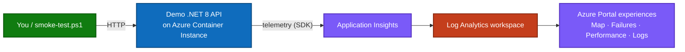
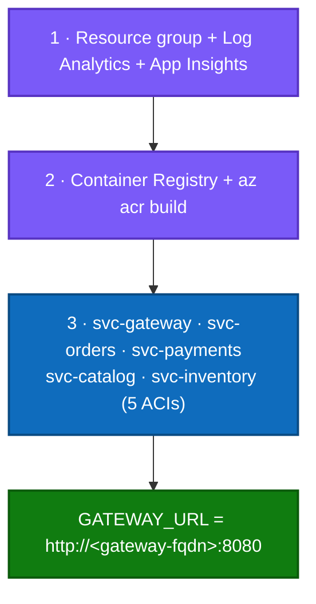
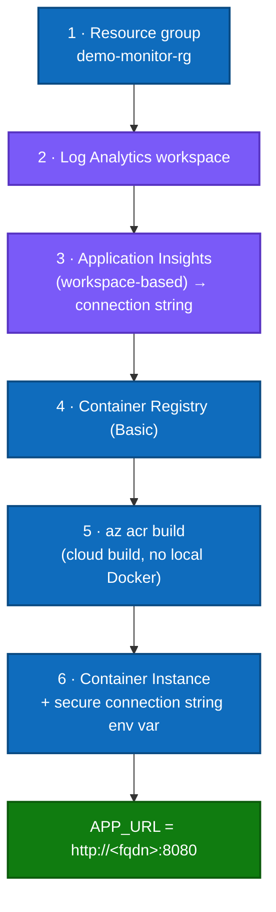
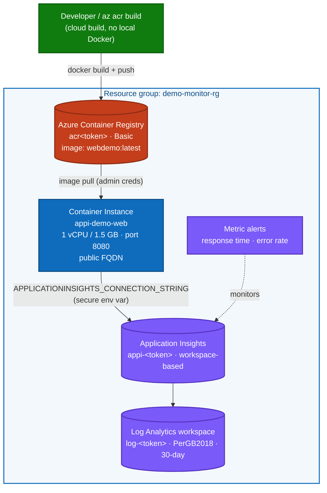
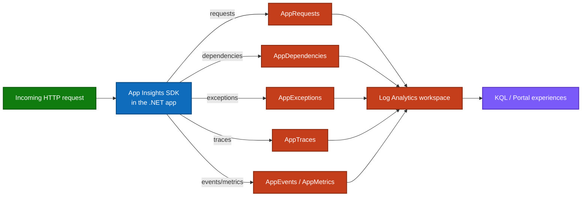
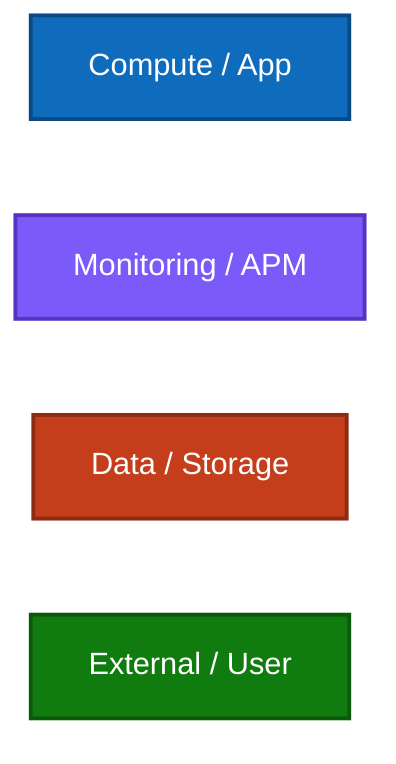
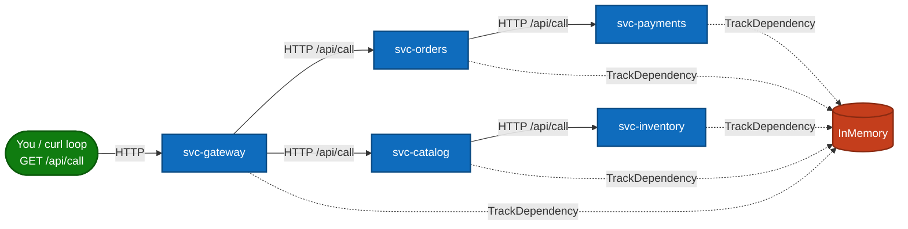

# Application Insights Demo — Deployment Guidance

> **Goal:** stand up a working Application Insights demo on Azure and explore what Azure
> Monitor shows you — from zero to live telemetry, using PowerShell.
>
> **Audience:** anyone new to Azure Monitor / Application Insights. No prior experience
> required.

---

## Table of contents

1. [Overview — what is Azure Monitor & Application Insights](#1-overview--what-is-azure-monitor--application-insights)
2. [How to enable Application Insights](#2-how-to-enable-application-insights)
3. [The demo scenario](#3-the-demo-scenario)
4. [What services get installed](#4-what-services-get-installed)
5. [Prerequisites](#5-prerequisites)
6. [Demo scenario — endpoints & what they prove](#6-demo-scenario--endpoints--what-they-prove)
7. [How to deploy using PowerShell](#7-how-to-deploy-using-powershell)
8. [What components are on it](#8-what-components-are-on-it)
9. [Architecture (colored Mermaid diagrams)](#9-architecture-colored-mermaid-diagrams)
10. [The 5-service mesh — `/api/call`, the map numbers & `InMemory`](#10-the-5-service-mesh--apicall-the-map-numbers--inmemory)

---

## 1. Overview — what is Azure Monitor & Application Insights

**Azure Monitor** is Microsoft's unified observability service. It collects **metrics,
logs, traces, and events** from your cloud and hybrid resources into a single platform so
you can understand health, performance, and reliability — then alert, visualize, and act.


*Source: [Microsoft Learn — Azure Monitor overview](https://learn.microsoft.com/en-us/azure/azure-monitor/fundamentals/overview).*

**Application Insights** is the **Application Performance Monitoring (APM)** feature of
Azure Monitor. You instrument your app with an SDK (or the OpenTelemetry distro); the SDK
ships telemetry to an ingestion endpoint, where it lands in a **Log Analytics workspace**
and becomes explorable through portal experiences like **Application Map**, **Failures**,
**Performance**, **Live Metrics**, and **Logs (KQL)**.


*Source: [Microsoft Learn — Application Insights overview](https://learn.microsoft.com/en-us/azure/azure-monitor/app/app-insights-overview).*

**How telemetry flows** — app → SDK → ingestion → Log Analytics → portal experiences:


*Source: [Microsoft Learn — Application Insights logic model](https://learn.microsoft.com/en-us/azure/azure-monitor/app/app-insights-overview#logic-model).*

| Telemetry type | What it captures | Log Analytics table |
|----------------|------------------|---------------------|
| Request | Each incoming HTTP call, duration, result code | `AppRequests` |
| Dependency | Outbound calls (HTTP, SQL, queues, in-memory) | `AppDependencies` |
| Exception | Handled/unhandled exceptions with stack traces | `AppExceptions` |
| Trace | Log lines (`ILogger`) with severity | `AppTraces` |
| Custom event / metric | Business events and KPIs you emit | `AppEvents` / `AppMetrics` |

---

## 2. How to enable Application Insights

There are **two ways** to get telemetry into Application Insights:

### Option A — Autoinstrumentation (codeless)

On supported hosts (Azure App Service, Azure Functions, AKS), you flip a **toggle** in the
portal — no code change required. The platform injects the agent for you.


*Source: [Microsoft Learn — Autoinstrumentation for Application Insights](https://learn.microsoft.com/en-us/azure/azure-monitor/app/codeless-overview).*

> **Note (from Microsoft Learn):** for **App Service on Linux published as a container**,
> autoinstrumentation supports *single-container* apps only; for full control you use
> code-based instrumentation with the Azure Monitor OpenTelemetry Distro.

### Option B — Code-based (what this demo uses)

This demo runs on **Azure Container Instances**, so it enables Application Insights **in
code** via the SDK. Three steps:

1. **Create** an Application Insights resource and get its **connection string**.
2. **Add the SDK** and register it:

```csharp
var builder = WebApplication.CreateBuilder(args);

// Reads APPLICATIONINSIGHTS_CONNECTION_STRING from configuration/env automatically.
builder.Services.AddApplicationInsightsTelemetry();
```

3. **Provide the connection string** at runtime as an environment variable:

```text
APPLICATIONINSIGHTS_CONNECTION_STRING = InstrumentationKey=...;IngestionEndpoint=...
```

That is exactly what [`scripts/deploy-aci.ps1`](../scripts/deploy-aci.ps1) injects as a
**secure environment variable** into the container.

---

## 3. The demo scenario

A small **.NET 8 web API** is deployed to Azure and instrumented with Application Insights.
It deliberately exposes endpoints that generate the full range of telemetry — successful
requests, failures, slow operations, and custom events — so you can see each Application
Insights experience light up with real data.



**Optional advanced scenario — 5-service mesh:** deploy five interconnected container
instances that call each other so the **Application Map** renders a real multi-node
distributed topology. See [`scripts/deploy-mesh-aci.ps1`](../scripts/deploy-mesh-aci.ps1)
and section 7a of [aci-deployment-guide.md](aci-deployment-guide.md).

---

## 4. What services get installed

The demo deploys **five Azure resources** into one resource group (`demo-monitor-rg`).
ACI is only the *compute host* — Application Insights, Log Analytics, and the registry do
the rest.

| # | Resource | Azure type | Purpose |
|---|----------|-----------|---------|
| 1 | `log-<token>` | `Microsoft.OperationalInsights/workspaces` | Log Analytics — stores all telemetry |
| 2 | `appi-<token>` | `Microsoft.Insights/components` | Application Insights — APM / query surface |
| 3 | `acr<token>` | `Microsoft.ContainerRegistry/registries` | Container Registry (Basic) — holds the image |
| 4 | `appi-demo-web` | `Microsoft.ContainerInstance/containerGroups` | **Container Instance — runs the app** |
| 5 | Failure Anomalies | `microsoft.alertsmanagement/smartDetectorAlertRules` | Smart-detector rule (auto-created with App Insights) |

> The app **runs on ACI**, is **monitored by** Application Insights + Log Analytics, is
> **built from** an Azure Container Registry, and is **watched by** a smart-detector alert
> rule.

---

## 5. Prerequisites

| Tool | Check | Install |
|------|-------|---------|
| Azure CLI | `az version` | <https://aka.ms/installazurecli> |
| App Insights CLI extension | `az extension show -n application-insights` | `az extension add -n application-insights` |
| PowerShell 5.1+ | `$PSVersionTable.PSVersion` | built-in on Windows |
| An Azure subscription | `az account show` | <https://azure.microsoft.com/free> |

> **No local Docker required** — the container image is built **in the cloud** with
> `az acr build`.

Sign in before deploying:

```powershell
az login
az account set --subscription "<subscription-id-or-name>"
```

---

## 6. Demo scenario — endpoints & what they prove

After deployment the app exposes these endpoints. Each maps to an Application Insights
experience so you can see telemetry appear.

| Endpoint | Method | What it generates | Where to see it |
|----------|--------|-------------------|-----------------|
| `/api/health` | GET | Healthy request | **Performance**, **Live Metrics** |
| `/api/products` | GET / POST | Request + in-memory **dependency** | **Application Map** (the `InMemory` node) |
| `/api/simulate-error` | GET | ~30% throw an exception (HTTP 500) | **Failures** (exceptions) |
| `/api/load-test` | GET | CPU-bound work across tasks | **Performance** (slow operation) |
| `/api/memory-test` | GET | Allocates memory + custom metric/event | **Metrics**, **Logs** (custom event) |

Drive traffic and verify ingestion:

```powershell
# Hit every endpoint (health, products, intentional errors, load + memory tests)
powershell.exe -NoProfile -ExecutionPolicy Bypass -File "scripts\smoke-test.ps1"

# Confirm rows landed (queries the Log Analytics App* tables directly)
powershell.exe -NoProfile -ExecutionPolicy Bypass -File "scripts\check-telemetry.ps1"
```

> **Ingestion latency:** first telemetry can take **2–5 minutes** to appear. If a query is
> empty, wait and re-run `check-telemetry.ps1`.

---

## 7. How to deploy using PowerShell

> **Which script do I run?** Use the scripts in the repository-root **`scripts/`** folder.
> For a rich, multi-node **Application Map** (the demo most people want) deploy the
> **5-service mesh** with [`scripts/deploy-mesh-aci.ps1`](../scripts/deploy-mesh-aci.ps1).
> For a minimal single-node demo, use [`scripts/deploy-aci.ps1`](../scripts/deploy-aci.ps1).
> Earlier App Service / Functions scripts (`deploy.ps1`, `demo-final.ps1`) have been
> **removed** — they targeted a hosting model this demo no longer uses.

### Option A — 5-service mesh (recommended for the demo)

Deploys **five** container instances that call each other so the Application Map renders a
real distributed topology. Full details in section 10.

```powershell
# 1. Build the image once and create all 5 wired-up ACIs (svc-gateway → … → InMemory)
powershell.exe -NoProfile -ExecutionPolicy Bypass -File "scripts\deploy-mesh-aci.ps1"

# 2. Drive traffic through the gateway (cascades through the whole chain)
powershell.exe -NoProfile -ExecutionPolicy Bypass -File "scripts\mesh-traffic.ps1" `
  -GatewayUrl "http://<gateway-fqdn>:8080" -Count 50

# 3. Confirm the map nodes + edges from telemetry
powershell.exe -NoProfile -ExecutionPolicy Bypass -File "scripts\verify-mesh.ps1"
```

The script prints `MESH_RESULT=SUCCESS` and a `GATEWAY_URL=...` line when finished. What it
deploys:



> **Cost note:** the mesh runs 5 × (1 vCPU / 1.5 GB) container instances. Delete them when
> done (see [Clean up](#clean-up)).

### Option B — single-service deploy (minimal)

Deploys **one** container instance — a single node plus its `InMemory` dependency.

```powershell
# Creates the RG, Log Analytics, App Insights, ACR, builds the image, runs 1 ACI.
powershell.exe -NoProfile -ExecutionPolicy Bypass -File "scripts\deploy-aci.ps1"
```

The script prints `DEPLOY_RESULT=SUCCESS` and an `APP_URL=...` line when finished. What it
does, step by step:



To re-deploy reusing existing resources (faster), use
[`scripts/finish-aci.ps1`](../scripts/finish-aci.ps1).

### Option C — Infrastructure as Code (ARM template)

Because **ACI cannot pull an image that doesn't exist yet**, deploy in **three phases**.

```powershell
# Create the resource group
az group create --name demo-monitor-rg --location "North Europe"

# Phase 1 — registry + monitoring only (no container yet)
az deployment group create `
  --resource-group demo-monitor-rg `
  --template-file azure-monitor-demo/infra/main.json `
  --parameters azure-monitor-demo/infra/main.parameters.json `
  --parameters deployContainerGroup=false

# Grab the registry name, then build & push the image (cloud build)
$acr = az deployment group show -g demo-monitor-rg -n main `
  --query "properties.outputs.containerRegistryName.value" -o tsv
az acr build --registry $acr --image webdemo:latest azure-monitor-demo/src/web

# Phase 3 — create the container now that the image exists
az deployment group create `
  --resource-group demo-monitor-rg `
  --template-file azure-monitor-demo/infra/main.json `
  --parameters azure-monitor-demo/infra/main.parameters.json `
  --parameters deployContainerGroup=true

# Live URL
az deployment group show -g demo-monitor-rg -n main `
  --query "properties.outputs.appUrl.value" -o tsv
```

### Clean up

```powershell
az group delete --name demo-monitor-rg --yes --no-wait
```

---

## 8. What components are on it

| Layer | Component | Detail |
|-------|-----------|--------|
| **App** | .NET 8 minimal-API web app | `Microsoft.ApplicationInsights.AspNetCore`, Swagger UI |
| **Instrumentation** | App Insights SDK | `AddApplicationInsightsTelemetry()` reads `APPLICATIONINSIGHTS_CONNECTION_STRING` |
| **Container image** | `webdemo:latest` | Multi-stage [Dockerfile](../azure-monitor-demo/src/web/Dockerfile); listens on `:8080` |
| **Compute** | Azure Container Instance | 1 vCPU / 1.5 GB, public FQDN, port 8080 |
| **Registry** | Azure Container Registry (Basic) | Holds the image; admin creds used for the pull |
| **APM** | Application Insights (workspace-based) | Map, Failures, Performance, Live Metrics |
| **Store** | Log Analytics workspace | `PerGB2018`, 30-day retention; `App*` tables |
| **Alerting** | Metric alerts + smart detection | High Response Time, High Error Rate, Failure Anomalies |

---

## 9. Architecture (colored Mermaid diagrams)

### Deployment topology



### Telemetry flow



### Color legend



---

## 10. The 5-service mesh — `/api/call`, the map numbers & `InMemory`

The optional mesh deploys **five separate container instances** running the *same* image,
each with a distinct `cloud_RoleName` (`svc-gateway`, `svc-orders`, `svc-payments`,
`svc-catalog`, `svc-inventory`). One endpoint — **`GET /api/call`** — turns them into a
real distributed system on the **Application Map**.

### How `/api/call` fans out to every service

When you hit the **gateway's** `/api/call`, it reads `DOWNSTREAM_SERVICES` and calls each
downstream service's `/api/call`, which in turn calls *its* downstream — a cascade. The App
Insights SDK auto-tracks every outbound HTTP call as a **dependency** and propagates W3C
trace context, so the whole chain correlates into one operation and renders as connected
**nodes + edges**.



Drive the cascade from your machine (replace the FQDN with your gateway URL):

```bash
for i in $(seq 1 50); do
  curl -s "http://<gateway-fqdn>:8080/api/call" > /dev/null
  echo "request $i sent"
done
```

### Reading the numbers on each node & edge

Every node and edge on the map shows two values — and they mean different things:

| What you see | Example | Meaning |
|--------------|---------|---------|
| **Call count** | `281 calls` | **Total** number of calls in the selected time range (not per-call). |
| **Duration** | `74.1 ms` | **Average** time for a *single* call (not a sum). |
| **Failure %** | `< 1%` | Share of calls that **failed** (error/HTTP 5xx). Lower is healthier. |
| **Instances** | `1 instance` | Number of containers running that role (here, one ACI per service). |

> **Why upstream nodes show a bigger duration:** `svc-gateway` (~149 ms) is *slower* than
> `svc-catalog` (~74 ms) because the gateway's time **includes** waiting for its downstream
> chain to respond. Each hop down the tree is faster because it waits on less.

### What is the `InMemory (OTHER)` node?

`InMemory` is **not** a deployed server, database, or container — it is a **simulated
dependency**. It exists only as a string label inside the code:

```csharp
// Program.cs — every service runs this; it fakes a DB/cache call
telemetry.TrackDependency("InMemory", "LocalWork", startTime, duration, success: true);
```

Because **all five** services execute these `TrackDependency("InMemory", ...)` lines, every
node draws an edge to the **one shared `InMemory` node**. App Insights labels it `OTHER`
because the dependency type isn't a recognized one (SQL, HTTP, etc.). In a real app this
line would be an actual SQL/Redis/HTTP call — and the SDK would track it automatically the
same way.

> **Tip for a clean map:** set the time range to **Last 30 minutes** before presenting so
> only the live mesh nodes show (old/deleted roles drop off once their data ages out).

---

## Reference files

| File | Purpose |
|------|---------|
| [`scripts/deploy-aci.ps1`](../scripts/deploy-aci.ps1) | Full scripted deploy (RG → LA → AI → ACR → build → ACI) |
| [`scripts/finish-aci.ps1`](../scripts/finish-aci.ps1) | Re-deploy reusing existing resources |
| [`scripts/smoke-test.ps1`](../scripts/smoke-test.ps1) | Generate demo traffic across all endpoints |
| [`scripts/check-telemetry.ps1`](../scripts/check-telemetry.ps1) | Verify ingestion via Log Analytics `App*` tables |
| [`scripts/deploy-mesh-aci.ps1`](../scripts/deploy-mesh-aci.ps1) | Optional 5-service mesh for a multi-node Application Map |
| [`azure-monitor-demo/infra/main.json`](../azure-monitor-demo/infra/main.json) | ACI + ACR + monitoring ARM template |
| [`azure-monitor-demo/src/web/Dockerfile`](../azure-monitor-demo/src/web/Dockerfile) | Multi-stage build for the web app |
| [`docs/aci-deployment-guide.md`](aci-deployment-guide.md) | Deep-dive guide incl. portal blades & the 5-ACI mesh |
