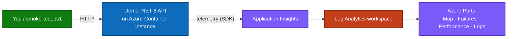

# Azure Monitor & Application Insights Demo
{: .fs-9 }

Deploy a fully instrumented **.NET 8 API** to Azure and watch every **Application
Insights** experience light up with real telemetry — requests, failures, slow
operations, dependencies, and a live **Application Map**.
{: .fs-6 .fw-300 }

[Get Started](deployment-guidance.html){: .btn .btn-primary .fs-5 .mb-4 .mb-md-0 .mr-2 }
[View Architecture](deployment-guidance.html#9-architecture-colored-mermaid-diagrams){: .btn .fs-5 .mb-4 .mb-md-0 .mr-2 }
[GitHub Repo](https://github.com/ibranibeny/ApplicationInsights-AzureDemo){: .btn .fs-5 .mb-4 .mb-md-0 }

---

## What You'll Build

A small **.NET 8 web API** running on **Azure Container Instances**, instrumented with the
Application Insights SDK. The app exposes endpoints that each generate a distinct kind of
telemetry, so you can demonstrate the complete observability story end to end:

- **Live Metrics** streaming as requests flow in
- **Application Map** showing the app and its dependencies (optionally a 5-node mesh)
- **Failures** populated by deliberate, intermittent exceptions
- **Performance** highlighting CPU-bound and memory-heavy operations
- **Logs (KQL)** and **custom metrics/events** for deep analysis
- A **Failure Anomalies** smart-detection alert, auto-provisioned

## Architecture at a Glance

| Layer | Resource | Role |
|-------|----------|------|
| Compute | **Azure Container Instance** (`appi-demo-web`) | Runs the .NET 8 API on port 8080 |
| Registry | **Azure Container Registry** (Basic) | Stores the `webdemo:latest` image |
| Monitoring | **Application Insights** (workspace-based) | APM, Map, Failures, Performance |
| Data | **Log Analytics workspace** | Stores all ingested telemetry |
| Alerting | **Failure Anomalies** rule | Smart detection on the App Insights resource |

## Workshop Modules

| # | Module | What you do | Time |
|---|--------|-------------|------|
| 1 | [Overview](deployment-guidance.html#1-overview-what-is-azure-monitor-application-insights) | Understand Azure Monitor & Application Insights | ~5 min |
| 2 | [Enable App Insights](deployment-guidance.html#2-how-to-enable-application-insights) | Autoinstrumentation vs. code-based SDK | ~5 min |
| 3 | [The demo scenario](deployment-guidance.html#3-the-demo-scenario) | Map endpoints to telemetry experiences | ~5 min |
| 4 | [Prerequisites](deployment-guidance.html#5-prerequisites) | Azure CLI, subscription, Docker/ACR build | ~5 min |
| 5 | [Deploy with PowerShell](deployment-guidance.html#7-how-to-deploy-using-powershell) | Run the scripted deployment | ~10 min |
| 6 | [Generate & verify telemetry](demo-walkthrough.html) | Smoke-test, then explore the portal | ~15 min |
| 7 | [ACI deep-dive & mesh](aci-deployment-guide.html) | Portal blades + the 5-service Application Map | ~15 min |
| 8 | [Cost & cleanup](cost.html) | Understand cost and tear everything down | ~5 min |

## Key Design Decisions

- **Azure Container Instances, not App Service** — this subscription has App Service
  dedicated-worker quota = 0. ACI runs the same container image and the same App
  Insights SDK, so the telemetry experience is identical.
- **Workspace-based Application Insights** — telemetry lands in a Log Analytics
  workspace, queryable with KQL and ready for alerts.
- **Real telemetry only** — every chart in the demo comes from exercising the actual
  app. Nothing is fabricated.
- **Optional 5-service mesh** — for a richer Application Map, deploy five interconnected
  containers that call each other to render a true distributed topology.

{: .note }
> **New here?** Start with the **[Deployment Guidance](deployment-guidance.html)** — it
> walks you from zero to a running, telemetry-emitting demo, with copy-paste PowerShell
> and colored architecture diagrams.
